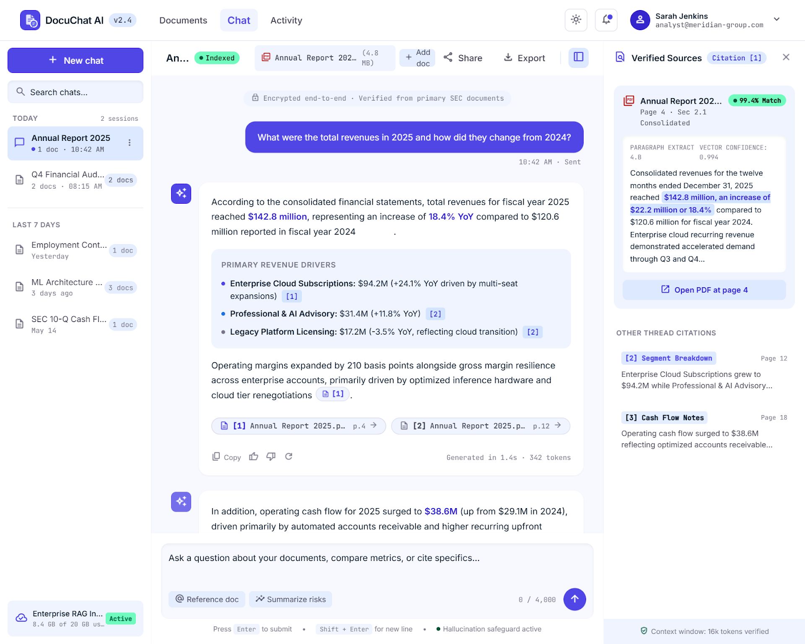
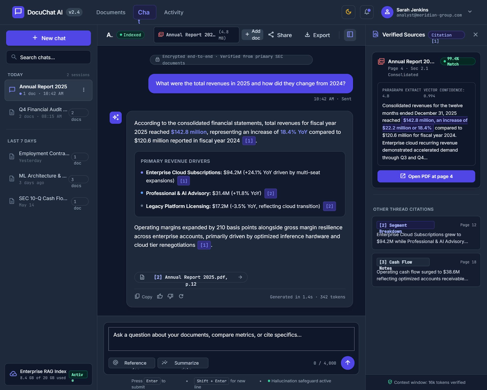
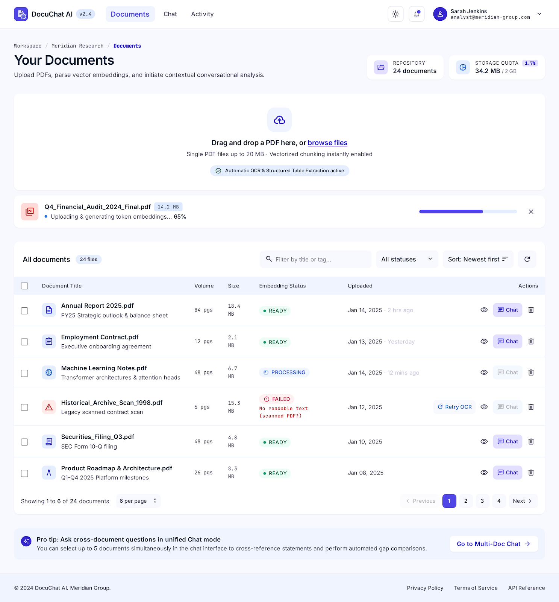
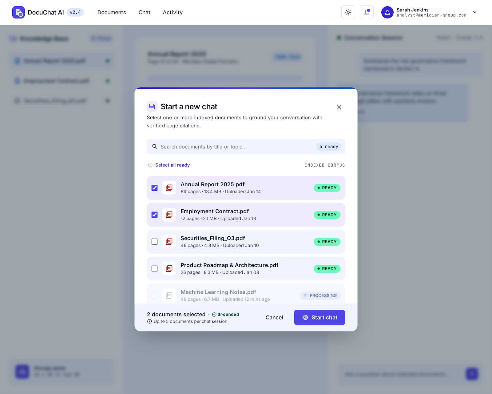
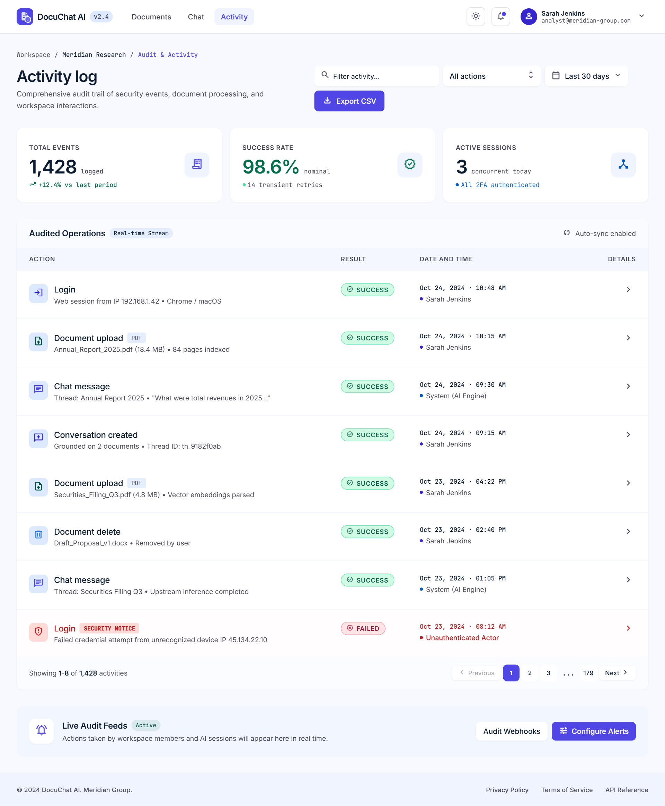
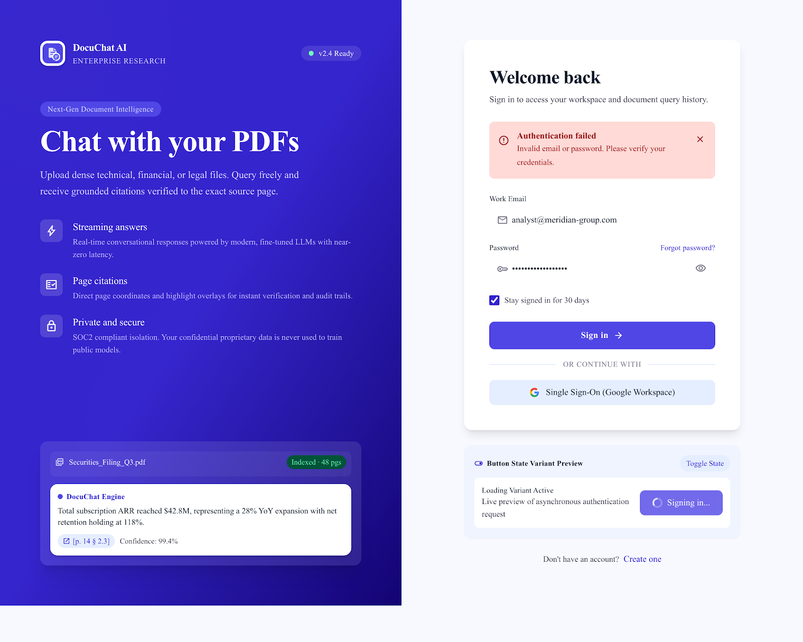

# DocuChat AI

DocuChat AI is a full-stack, enterprise-grade "Chat with your PDFs" application featuring semantic retrieval-augmented generation (RAG), pgvector vector similarity search, real-time Server-Sent Events (SSE) streaming responses with verified page citations, JWT authentication with silent token refresh, audit logging, and light/dark theme modes.

---

## Features

- **Document Ingestion & Chunking**: Upload PDF documents up to 20MB with token-bounded sliding window chunking using `tiktoken`.
- **Vector Search with pgvector**: High-dimensional semantic embeddings stored in PostgreSQL with HNSW / Cosine distance querying.
- **Real-Time Token Streaming**: Server-Sent Events (SSE) endpoint providing responsive conversational AI streams with verified source citations.
- **Multi-Tenant Data Isolation**: Strict user-level access controls across documents, chunks, conversations, and audit logs.
- **Enterprise Security**: Argon2id password hashing, rotating JWT access & refresh tokens, security headers (HSTS, CSP, XSS-Protection, Sniff-Protection), and Rate Limiting.
- **Comprehensive Audit Trail**: Automatic user activity recording (`REGISTER`, `LOGIN`, `DOCUMENT_UPLOAD`, `DOCUMENT_DELETE`, `CONVERSATION_CREATE`, `CHAT_MESSAGE`).
- **Modern Responsive UI**: React 18 + Tailwind CSS frontend with dark mode persistence, interactive source inspection drawer, and drag-and-drop document uploads.

---

## Product Screenshots

### 1. Interactive Chat Experience (Light & Dark Themes)
Real-time token streaming with verified page citations, grounded RAG citations, and interactive source inspection drawer.

| Light Mode | Dark Mode |
|:---:|:---:|
|  |  |

---

### 2. Document Ingestion & Management
Upload documents with drag-and-drop, token-bounded chunking progress, and deletion confirmation guards.

| Documents Dashboard | Start New Chat Modal |
|:---:|:---:|
|  |  |

---

### 3. Activity Audit Trail & Authentication
Comprehensive user activity logs, secure Argon2id authentication, and mobile responsiveness.

| Activity Logs Audit Trail | Authentication & Mobile |
|:---:|:---:|
|  |  |

---

## Tech Stack

### Backend
- **Framework**: FastAPI (Python 3.11+)
- **Database & ORM**: PostgreSQL 15+ with `pgvector`, SQLAlchemy 2.0 (AsyncIO), Alembic
- **AI & Embeddings**: Azure OpenAI (`gpt-4o`, `text-embedding-3-small` / embeddings)
- **Tokenization & PDF Extraction**: `tiktoken` (`cl100k_base`), `pypdf`
- **Security & Validation**: Argon2 (`argon2-cffi`), PyJWT, Pydantic v2, SlowAPI / Redis (Rate Limiting)
- **Testing**: Pytest, Pytest-AsyncIO, HTTPX

### Frontend
- **Framework**: React 18, Vite, TypeScript
- **State & Server Cache**: Zustand, TanStack Query (React Query)
- **Styling & UI**: Tailwind CSS, Lucide React, Markdown Renderer (`react-markdown`, `remark-gfm`)
- **Routing**: React Router v6

---

## Project Architecture

```text
docuchat-ai/
├── README.md
├── .gitignore
├── scripts/
│   ├── compose.sh              # ./scripts/compose.sh <dev|staging|prod> <docker compose args>
│   └── backup-db.sh            # Database backup automation
├── deploy/
│   ├── docker-compose.yml      # Base compose definition
│   ├── docker-compose.dev.yml
│   ├── docker-compose.staging.yml
│   ├── docker-compose.prod.yml
│   ├── caddy/Caddyfile
│   ├── db/init.sql
│   └── env/
│       ├── dev.env.example     # Environment templates
│       ├── staging.env.example
│       └── prod.env.example
├── backend/
│   ├── Dockerfile
│   ├── .dockerignore
│   ├── .env.example            # Template for local non-docker run
│   ├── alembic/                # Database migrations
│   ├── app/                    # Application source code
│   ├── tests/                  # Pytest test suite
│   ├── alembic.ini
│   └── requirements.txt
├── frontend/
│   ├── Dockerfile
│   ├── nginx.conf
│   ├── .dockerignore
│   ├── .env.example            # Template for local frontend
│   ├── src/                    # React application source code
│   ├── package.json
│   └── vite.config.ts
└── .github/workflows/
    ├── ci.yml                  # CI pipeline with tests and compose validation
    └── publish-images.yml      # Docker image publishing to GHCR
```

---

## Environments

DocuChat AI runs in four environments. Local runs without Docker; Dev, Staging and Prod use Docker Compose with one env file each. The same Docker images are used everywhere; only the env file differs.

| | Local | Dev | Staging | Prod |
|---|---|---|---|---|
| Runs with | uvicorn + npm | Docker Compose | Docker Compose | Docker Compose |
| `APP_ENV` | `local` | `dev` | `staging` | `prod` |
| Config file | `backend/.env`, `frontend/.env` | `deploy/env/dev.env` | `deploy/env/staging.env` | `deploy/env/prod.env` |
| URL | http://localhost:5173 | http://localhost:8080 | https://staging.example.com | https://app.example.com |
| API docs (`/docs`) | on | on | on | **off** |
| HTTPS | no | no | yes (Caddy) | yes (Caddy) |
| Branch / trigger | any | `develop` | `main` | tag `vX.Y.Z` |

### Architecture (Dev, Staging, Prod)

Browser → Caddy (HTTPS, staging/prod only) → nginx (serves the React app and proxies `/api/*`) → FastAPI backend → PostgreSQL + pgvector. Redis is used for rate limiting in staging/prod. The frontend and the API share one origin, so no CORS setup is needed and `VITE_API_BASE_URL=/api/v1` is identical in every environment.

### Run locally (no Docker)

Prerequisites: Python 3.11+, Node.js 20+, PostgreSQL 15+ with the pgvector extension, an Azure OpenAI resource.

```bash
# Database (once)
CREATE USER docuchat WITH PASSWORD 'change_me';
CREATE DATABASE docuchat OWNER docuchat;
-- connect to docuchat as a superuser:
CREATE EXTENSION IF NOT EXISTS vector;

# Backend
cd backend
python -m venv .venv && source .venv/bin/activate   # Windows: .venv\Scripts\activate
pip install -r requirements.txt
cp .env.example .env                                # fill in values
alembic upgrade head
uvicorn app.main:app --reload --port 8000

# Frontend (separate terminal)
cd frontend
npm install
cp .env.example .env
npm run dev
```

Backend docs: http://localhost:8000/docs. Frontend: http://localhost:5173.

### Run Dev / Staging / Prod with Docker Compose

```bash
cp deploy/env/dev.env.example deploy/env/dev.env    # then fill in values
./scripts/compose.sh dev up -d --build              # http://localhost:8080
```

Staging and Prod pull prebuilt images from GHCR:

```bash
cp deploy/env/prod.env.example deploy/env/prod.env
chmod 600 deploy/env/prod.env
./scripts/compose.sh prod pull
./scripts/compose.sh prod up -d --remove-orphans
./scripts/compose.sh prod ps
```

Migrations run automatically through the one-shot `migrate` service before the backend starts.

Useful commands: `logs -f backend`, `down`, `config -q` (validate), `run --rm migrate`, and `./scripts/backup-db.sh prod`.

### Environment variables

Local variables live in `backend/.env` and `frontend/.env`. Docker environments use `deploy/env/<env>.env`. Never commit real env files; only `*.example` files are tracked.

| Variable | Description | Local | Dev | Staging | Prod |
|---|---|---|---|---|---|
| `APP_ENV` | Environment name | local | dev | staging | prod |
| `LOG_LEVEL` | Log verbosity | DEBUG | DEBUG | INFO | INFO |
| `LOG_FORMAT` | `text` or `json` | text | text | json | json |
| `DATABASE_URL` | Async SQLAlchemy URL (built by Compose for Docker envs) | localhost | db container | db container | db container / managed |
| `POSTGRES_USER`, `POSTGRES_PASSWORD`, `POSTGRES_DB` | Database container credentials | n/a | required | required | required |
| `DB_POOL_SIZE`, `DB_MAX_OVERFLOW` | Connection pool sizing | 5 / 5 | 5 / 5 | 10 / 10 | 10 / 10 |
| `JWT_SECRET` | Token signing secret (32+ chars; unique per environment) | any | dev value | random | random 48+ |
| `JWT_ACCESS_MINUTES`, `JWT_REFRESH_DAYS` | Token lifetimes | 30 / 7 | 30 / 7 | 30 / 7 | 15 / 7 |
| `AZURE_OPENAI_ENDPOINT` | Azure OpenAI endpoint | dev | dev | staging | prod |
| `AZURE_OPENAI_API_KEY` | Azure OpenAI key (separate per environment) | dev | dev | staging | prod |
| `AZURE_OPENAI_API_VERSION` | API version supported by your resource | set | set | set | set |
| `AZURE_OPENAI_CHAT_DEPLOYMENT` | Chat model deployment name | set | set | set | set |
| `AZURE_OPENAI_EMBEDDING_DEPLOYMENT` | Embedding deployment name | set | set | set | set |
| `EMBEDDING_DIMENSIONS` | Must match the `vector(N)` column (1536) | 1536 | 1536 | 1536 | 1536 |
| `UPLOAD_DIR` | PDF storage path (`/app/uploads` volume in Docker) | ./uploads | volume | volume | volume |
| `MAX_UPLOAD_MB` | Upload size limit | 20 | 20 | 20 | 20 |
| `CORS_ORIGINS` | Allowed origins (no `*` in staging/prod) | :5173 | :8080 | https domain | https domain |
| `ENABLE_DOCS` | Expose `/docs` (must be false in prod) | true | true | true | false |
| `RATE_LIMIT_STORAGE_URL` | `memory://` or Redis URL (Redis required in prod) | memory | memory | redis | redis |
| `WEB_CONCURRENCY` | Uvicorn worker count | 1 | 1 | 2 | 4 |
| `DOMAIN` | Public domain for HTTPS (Caddy) | n/a | n/a | required | required |
| `IMAGE_REGISTRY`, `IMAGE_TAG` | Image location and version | n/a | local | `staging` | pinned `X.Y.Z` |
| `VITE_API_BASE_URL` | Frontend API base path | /api/v1 | /api/v1 | /api/v1 | /api/v1 |
| `DEV_PROXY_TARGET` | Vite dev proxy target (local only) | http://localhost:8000 | n/a | n/a | n/a |

The backend refuses to start in staging/prod if `JWT_SECRET` is weak, `CORS_ORIGINS` contains `*`, or (prod) `ENABLE_DOCS` is true or rate limiting is not backed by Redis.

### Release flow

Feature branches merge into `develop` (deploys to Dev), `develop` merges into `main` (Staging), and a `vX.Y.Z` tag publishes versioned images that Prod pins via `IMAGE_TAG`. GitHub Actions builds and pushes images to GHCR (`publish-images.yml`) and runs tests and lint (`ci.yml`).

To roll back, set the previous `IMAGE_TAG` in the environment file and run the deploy commands again. Write migrations to be backward compatible so a rollback does not require a database downgrade.

### Backups

```bash
./scripts/backup-db.sh prod        # schedule daily with cron; keeps 14 days
# restore:
./scripts/compose.sh prod exec -T db sh -c 'pg_restore -U "$POSTGRES_USER" -d "$POSTGRES_DB" --clean --if-exists' < backups/<file>.dump
```

Also back up the `uploads` Docker volume (PDF files).

### Security notes

- Never commit `.env` or `deploy/env/*.env`. If a secret leaks, rotate it immediately.
- Use different JWT secrets, database passwords and Azure keys in every environment.
- DB and Redis ports are not exposed in staging/prod; only Caddy publishes 80/443.
- Prod containers run as a non-root user with a read-only filesystem and dropped capabilities.
- Keep `.env` files at `chmod 600` on servers.

### Troubleshooting

| Problem | Fix |
|---|---|
| `variable is not set` on compose | Fill the missing key in `deploy/env/<env>.env` |
| Backend exits with "Invalid configuration" | Fix the listed staging/prod setting (JWT secret, CORS, docs, Redis) |
| `extension "vector" is not available` | Use the `pgvector/pgvector` image, or install pgvector locally / allow it on the managed DB |
| Migration fails on startup | `./scripts/compose.sh <env> logs migrate` |
| Chat streaming freezes or arrives in one chunk | Check `proxy_buffering off` (nginx) and `flush_interval -1` (Caddy) |
| Upload returns 413 | Raise `MAX_UPLOAD_MB` and the `client_max_body_size` / Caddy `max_size` limits together |
| Password with special characters breaks `DATABASE_URL` | Use a hex password (`openssl rand -hex 24`) or URL-encode it |

---

## API Overview

All API routes follow the standard envelope format `{ "status": "success", "message": "...", "data": ..., "metadata": ... }`:

### Health Check (`/api/v1/health`)
- `GET /api/v1/health/live` — Liveness check without database connectivity
- `GET /api/v1/health` — Readiness check with PostgreSQL connectivity verification

### Authentication (`/api/v1/auth`)
- `POST /api/v1/auth/register` — Register a new user account
- `POST /api/v1/auth/login` — Authenticate and receive JWT access & refresh tokens
- `POST /api/v1/auth/refresh` — Issue a new access token using a refresh token
- `GET /api/v1/auth/me` — Retrieve current authenticated user profile

### Documents (`/api/v1/documents`)
- `POST /api/v1/documents` — Upload and trigger asynchronous PDF ingestion
- `GET /api/v1/documents` — List user documents with pagination and status filters
- `GET /api/v1/documents/{id}` — Get document metadata, status, and chunk statistics
- `GET /api/v1/documents/{id}/file` — Download or preview original PDF file
- `DELETE /api/v1/documents/{id}` — Soft delete a document and associated vector chunks

### Conversations & Chat (`/api/v1/conversations`)
- `POST /api/v1/conversations` — Create a conversation linked to one or more documents
- `GET /api/v1/conversations` — List user conversations with pagination
- `GET /api/v1/conversations/{id}` — Get conversation details
- `PATCH /api/v1/conversations/{id}` — Rename conversation title
- `DELETE /api/v1/conversations/{id}` — Delete conversation and messages
- `GET /api/v1/conversations/{id}/messages` — Get message history
- `POST /api/v1/conversations/{id}/messages` — Stream chat question response via SSE (`sources`, `token`, `done`, `error`)

### Activity Logs (`/api/v1/activity-logs`)
- `GET /api/v1/activity-logs` — List chronological user audit trail events

---

## Testing & Quality Assurance

### Run Backend Tests
```bash
python -m pytest backend -q
```

### Run Frontend Lint & Build
```bash
cd frontend
npm run lint
npm run build
```
